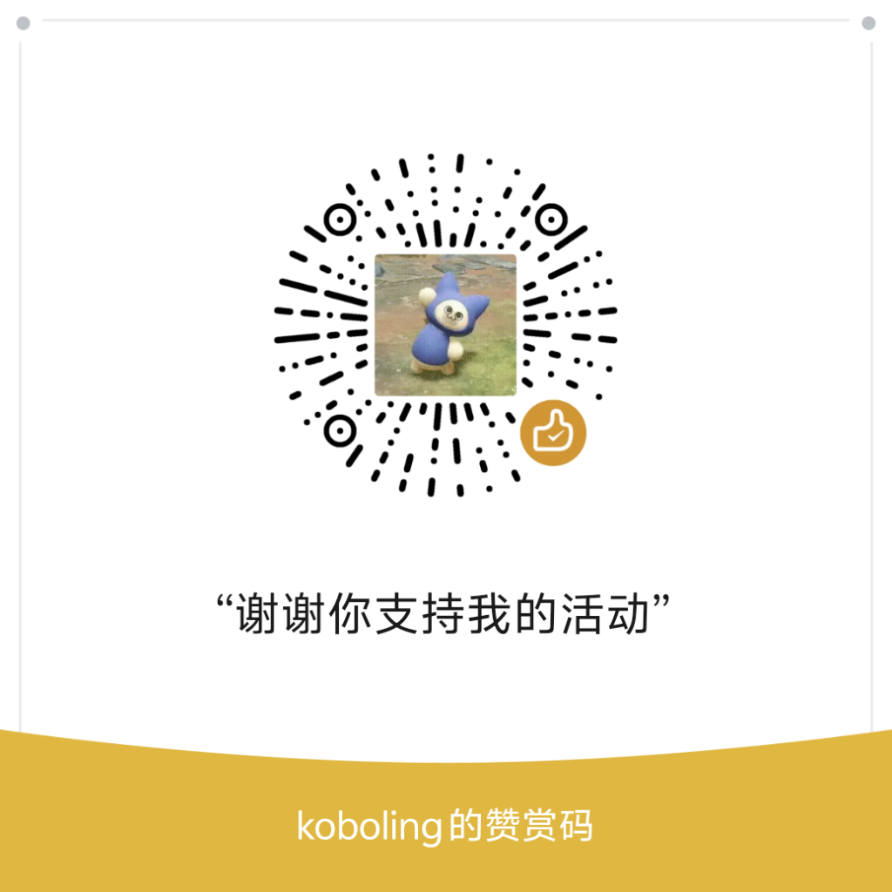

# API Tester

> 测试你的 OpenAI 兼容 API 是否可用。纯静态页面，密钥加密存储，不离开浏览器。

[English](./README_EN.md) | 中文

## Links

- 🌐 **在线使用**：[api-hero.pages.dev](https://api-hero.pages.dev)
- 💬 **Linux.do**：[linux.do](https://linux.do)

## 功能

- **智能识别** — 粘贴一段配置文本，自动提取 Base URL、API Key、模型名
- **服务商管理** — 以服务商为单位管理 API 配置，支持重命名、删除、刷新模型列表
- **自动获取模型** — 一键拉取服务商的全部可用模型，数量无限制
- **模型探测** — 从已导入的模型中选一个，查看哪些服务商支持，并逐个或批量测试连通性
- **AES-GCM 加密** — API Key 使用浏览器原生 Web Crypto API 加密存储
- **一键连通测试** — 发送消息验证 API 可用性，支持逐步 Ping 诊断（DNS → HTTPS → 认证 → 模型）
- **批量测试** — 一键测试所有已保存服务商的全部模型连通性
- **多平台导出** — 单个服务商或批量导出为 OpenAI .env / Codex CLI / Claude Code / Antigravity / OpenClaw / cURL / Python / JSON
- **ZIP 打包导出** — 一键导出所有服务商配置，每个一个 JSON，打包成 ZIP 下载
- **导入配置** — 支持 `.json` / `.env` / `.toml` / `.yaml` 文件导入，导入即自动保存
- **智能 URL 识别** — 自动处理 Base URL 加不加 `/v1`、尾斜杠等各种格式
- **CORS 代理** — 内置 Cloudflare Workers 代理，绕过 API 提供商的跨域限制
- **中英双语** — 默认中文，右上角切换英文
- **新手引导** — 首次访问自动弹出交互式引导

## 使用

直接访问在线地址，或本地打开 `index.html`。

> 本地打开时部分功能（模型获取、连接测试）可能受 CORS 限制，建议使用在线版本。

## 隐私

- 纯静态前端，Cloudflare Workers 仅做请求转发
- API Key 使用 AES-GCM 加密后存于 localStorage
- 不收集、不上传任何用户数据

## 赞助

如果觉得有用，请作者喝杯咖啡 ☕

- 💳 [PayPal](https://paypal.me/koboling)

## License

MIT

---

⭐ 喜欢的话点个 Star
